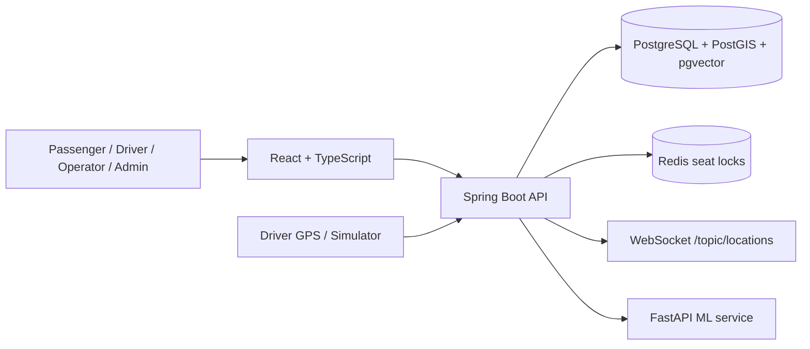

# Architecture

BusBD Intelligence is implemented as a modular monolith plus a separate Python ML service.

The Render production demo uses a single Docker image containing the compiled React application and Spring Boot API. When no managed PostgreSQL or Redis environment variables are provided, the live demo falls back to H2 and in-process seat locks. Local Docker Compose enables the complete PostgreSQL, Redis and FastAPI topology.
